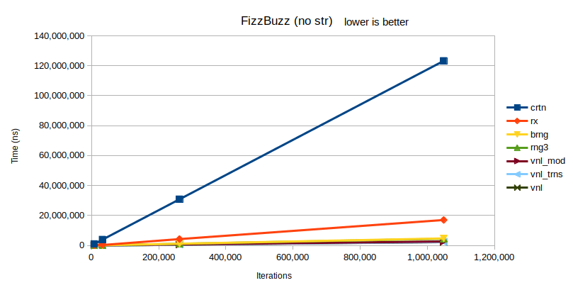
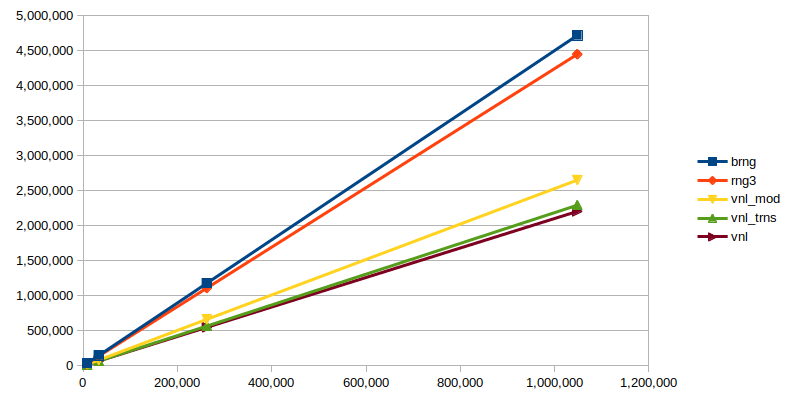
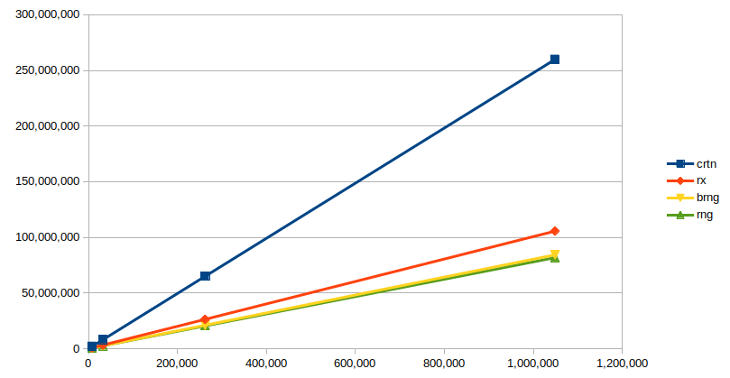

# Composability of basics blocks

It is often desirable to decompose a problem into multiple smaller and simpler (ideally) problems.
But it can be quite hard to compose back the solutions in a not too cumbersome way, while keeping the cost of abstraction as low as possible. 
We would like to build pipelines from small ad-hoc tasks. Unlike algorithms from STL such pipelines are meant to be lazily evaluated, making them perfect for stream processing and early terminating tasks. 


### Part I: FizzBuzz (https://en.wikipedia.org/wiki/Fizz_buzz)  
For each given number we have to mark it correctly, depending on its divisibility. 
Imagine we have a function that recognizes all cases of Fizz, and another two functions for Buzz and FizzBuzz respectively,
additionally, we have a special function to convert numbers, Fizzes, Buzzes, and FizzBuzzes to strings. 
For example, a Fizzer examines a given integer `n` and returns `n` for non-Fizz and `MARKER+3` for a Fizz number.
A Buzzer returns `n` for non-Buzz and `MARKER+5` for a Fizz number. We would like to construct the following pipeline:  
`ints` → `FizzBuzz` → `Fizz` → `Buzz` → `ToString`  
or  
`ints` → `FizzBuzz` → `Buzz` → `Fizz` → `ToString`  
(NB no other order will work for those).

The links of the chain are implemented as functions, e.g.:
```cpp
template<typename T, unsigned div_by>
T mark_divisble(T number);
```
or
```cpp
template<typename T>
std::string tostring(T number);
```

We can compose them as any function to form a chain:
```cpp
tostring(mark_divisibles<3>(mark_divisibles<5>(mark_divisibles<15>(i))))
```
Or, if we want to store the chain, and invoke it later:
```cpp
auto chain = [](unsigned i) { return tostring(mark_divisibles<3>(mark_divisibles<5>(mark_divisibles<15>(i)))); };
std::transform(input.begin(), input.end(), output.begin(), chain);
```
We can get away with this, since here (in this problem and this model) each stage emits a number every time.

Alas, this approach will execute redundant checks all the time.  
The following piece of code, while still using transform, and can potentially be executed with parallel execution policy, does not have this problem:  
```cpp
std::transform(//std::execution::par, in c++17 
               in.begin(), in.end(), out.begin(), 
               [](unsigned i){
                    if (i % 15 == 0) {
                        return 15 + helper::marker;
                    } else if (i % 5 == 0) {
                        return 5 + helper::marker;
                    } else if (i % 3 == 0) {
                        return 3 + helper::marker;
                    } else {
                        return i;
                    }
              });
```

Consider other "procedural" implementations of FizzBuzz in [vanilla](fzbz_vanilla.h).

#### ranges-v3 (https://github.com/ericniebler/range-v3)
The library is a *"basis for formal proposal to add range support to the C++ standard library"*. 
We can easily create an infinite (well, until overflows) range, then "pipe" it into transofrming views.

```cpp
auto rng =  view::ints(1) |  // emit integers from 1
            view::transform(mark_divisibles<15, int>) |
            view::transform(mark_divisibles<5, int>) |
            view::transform(mark_divisibles<3, int>);
RANGES_FOR(auto v, rng | view::take(limit-1)) { // stop after 'limit' emitted
        vec.push_back(v);
}            
```

#### Boost ranges (http://www.boost.org/doc/libs/1_66_0/libs/range/doc/html/index.html)
Since range-v3 *"draws inspiration from the Boost.Range"* we had to compare with origin: 

```cpp
using namespace boost::adaptors;
auto rng = boost::irange(1u, limit) | // emit integers from 1 to limit
           transformed(helper::mark_divisibles<15, int>) |
           transformed(helper::mark_divisibles<5, int>) |
           transformed(helper::mark_divisibles<3, int>);
```

#### RxCpp (https://github.com/Reactive-Extensions/RxCpp)
A bit of abuse, but since *"Reactive Extensions for C++ is a library of algorithms for values-distributed-in-time. The Range-v3 library does the same for values-distributed-in-space"*, we had to try it as well.
```cpp
auto rng = rxcpp::observable<>::range(1, limit)
            .map(helper::mark_divisibles<15, int>)
            .map(helper::mark_divisibles<5, int>)
            .map(helper::mark_divisibles<3, int>);
rng.subscribe([&vec](unsigned v){ vec.push_back(v);}, [](){});
```
Here we subscribe a lambda with a vector bound to it by reference and `push_back` each value we get from the producer. 
Note the difference between `push` and `pull` models. With ranges we are actively iterating to get the values.  
With rx we subscribe to values. With the latter we could easily create two subscribers, with ranges it would only be possible if either (a) the iterators are Forward, not just Input or (b) we allow for additional space to store a copy of the values.

#### Boost coroutine 2 (http://www.boost.org/doc/libs/1_65_1/libs/coroutine2/doc/html/index.html)
Even greater misuse. Boost introduces stackful asymmetric coroutines -- pull and push. 
They have awkward syntax and signatures, and quite low level. 

```cpp
    pull_t<unsigned> naturals_gen([&](push_t<unsigned> &s) { naturals_g(limit, s); });
    auto gen_uptr = naturals_gen | ifmod<15> | ifmod<3> | ifmod<5>;

    for (auto v : *gen_uptr)
        vec.push_back(v);
```

But to able to do it, we had to create several wrappers and helpers.

**1 ifmod**
```cpp
// we wrap mark_divisibles in a coroutine signature 
template<unsigned mmod>
void ifmod(push_t<unsigned> &sink, pull_t<unsigned> &source) {
    for (auto v : source)
        sink(mark_divisibles<mmod>(v));
}

//where:
template<typename T=int>
using coro_t = boost::coroutines2::coroutine<T>;
template<typename T=int>
using pull_t = typename coro_t<T>::pull_type;
template<typename T=int>
using push_t = typename coro_t<T>::push_type;
```

**2 piping**  
Since the coroutine signature demands two references, we can't bind temporaries, consts, rvalues, etc. 
One solution is to create the `pull` objects on the heap with `make_unique` and move it into the next stage, 
when binding the lambda. 
We only need to perform the allocations when "constructing" the pipe and this cost ought to be negligible. 
```cpp
template<typename Pull, typename C>
auto operator|(std::unique_ptr<Pull> source, C crtn) -> std::unique_ptr<pull_t<decltype(source->get())>>
{
    using T = decltype(source->get());
    return std::make_unique<pull_t<T>>([source=move(source), crtn](push_t<T>& sink){ crtn(sink, *source); });
};
```
This piping only works when the in-out types match. For other cases, e.g., converter of ints to strings, we use the `chain` function.

#### Benchmarking


We execute fizbuzz for different limits, using different methods. 
`crtn` denotes Boost coroutines 2 implementation, `rx` is RxCpp, `brng` is Boost Ranges, 
`rng3` is ranges-v3. `vnl*` are different "vanilla" procedural methods for control.   
In this execution the body of the work is extremely small -- not even string generation, integer division at most. 
Thus, the overhead of coroutines and Rx is huge.   

If we were to zoom in:  


Boost ranges and ranges-v3 have fairly comparable performance. Vanilla with integer divisions is a bit more costly than the version with `std::transform` (which benefits from either better vector population, or from loop unrolling, need to check further).
The procedural vanilla version with a lookup table and no integer division is the fastest.

If we convert to strings as well we get the following chart:

   

#### First summary
Yes, it is silly to use heavy artillery for trivial tasks. Coroutines and Rx are meant to be used for e.g. async. I/O -- disk or network communication that take ages.
Furthermore, both coroutines and Rx library introduce special abilities that were not used here. 
We will discuss those in the following section.

### Part II: Best/Worst records (https://www.hackerrank.com/challenges/breaking-best-and-worst-records/problem)

In this case we need to emit a list of best/worst records for an incoming stream of scores. 


Imagine, we want to build the following pipeline:
```
               ,--- best --- --- --- to_str
              |                 
 input --- tee                  
              |
               `--- negate --- best --- to_str_2
```

Here, `best` is a stateful predicate, that keeps the highest seen value. 
It can be used for getting the worst value if we negate the given integers.
Hence, we have to duplicate the input to both "branches". 
Component `tee` is responsible for this. If we can't replay the input stream, 
then we have no other choice, but to store a copy of stream values in it 
(see, e.g., python's implementation of [tee](https://docs.python.org/2/library/itertools.html#itertools.tee)).
But if it has the "multipass guarantee", like a ForwardIterator, we can simply produce two copies of the original input.


 
